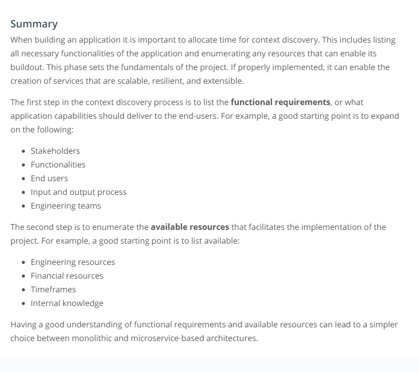

# Suse Cloud Native Foundation
## 1. Introduction to cloud fundamentals
### a. Introduction to cloud native
Cloud native refers to the set of practices that empowers organizations to <b>build and manage applications at scale.</b> 
They can achieve this goal by using private, hybrid, or public  cloud providers.

<b>Containers</b> are closely associated with cloud-native terminology. Containers are used to run a single application with 
all required dependencies. The main characteristics of containers are easy to manage, deploy, and fast to recover. 
As such, often, a microservice-based architecture is chosen in tandem with cloud-native tooling. Microservices are used
to manage and configure a collection of small, independent services that can be easily packaged and executed within a container.

## 1. Architecture considerations for cloud native
### a. Design considerations

### b. Monoliths and Microservices

